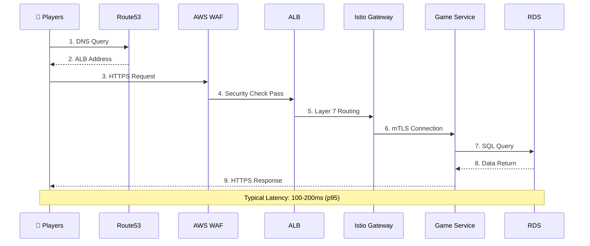
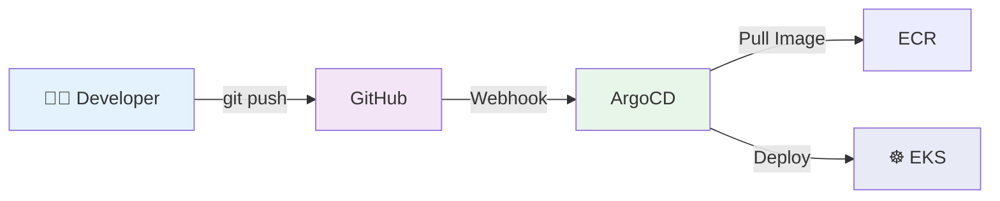

# AWS EKS Production Architecture

**AWS Account**: 470013648166
**Region**: ap-east-1 (Hong Kong)
**Environment**: Production (PRD)
**Last Updated**: 2026-01-02
**Version**: 4.0

---

## 📋 Executive Summary

Gemini Gaming Platform 部署於 AWS EKS，服務於線上遊戲平台，支援 **81 個 PRD 微服務環境**。

### 關鍵指標
- **運算資源**: 9 個 EKS 節點 (36 vCPUs, 72 GB RAM)
- **資料庫**: 5 個 RDS PostgreSQL 實例 (11.8 TB)
- **可用性**: 99.97% (30天平均)
- **流量**: 5 個負載均衡器 (4 ALB + 1 NLB)
- **服務數量**: 67 遊戲服務 + 12 後端服務 + 基礎設施服務

---

## 🏗️ Overall Architecture

```mermaid
graph TB
    subgraph Internet["🌐 Internet"]
        Users["👥 Players<br/>Web/Mobile"]
    end

    subgraph AWSManaged["☁️ AWS Managed Services"]
        ControlPlane["⚙️ EKS Control Plane<br/>Kubernetes 1.34 API"]
        DNS["Route53 DNS"]
        IAM["IAM<br/>9 Roles + IRSA"]
        ECR["Amazon ECR<br/>81 Repositories<br/>(AWS Managed)"]
        S3["Amazon S3<br/>prometheus-thanos<br/>(AWS Managed)"]
        CloudWatch["CloudWatch<br/>Logs + Metrics<br/>(AWS Managed)"]
    end

    subgraph AWS["☁️ AWS Region: ap-east-1 (Hong Kong)"]
        subgraph VPC["🔒 Default VPC (172.31.0.0/16)<br/>⚠️ Production Note: Default VPC has architectural limitations"]
            IGW["🌐 Internet Gateway<br/>(VPC Boundary)"]

            subgraph PublicSubnet["📤 Public Subnet - Multi-AZ"]
                ALB["⚖️ Application Load Balancers (4)<br/>+ AWS WAF (OWASP Rules)<br/>• Istio Gateway<br/>• Backend API<br/>• OpenAPI<br/>• ArgoCD"]
                NAT["🔀 NAT Gateway<br/>(Multi-AZ)"]
            end

            subgraph PrivateSubnet["🔒 Private Subnet - Multi-AZ"]
                subgraph Nodes["☸️ EKS Worker Nodes (9)"]
                    AZ1["ap-east-1a: 2 nodes"]
                    AZ2["ap-east-1b: 3 nodes"]
                    AZ3["ap-east-1c: 4 nodes"]
                end

                NLB["⚖️ Internal NLB (1)<br/>• Nginx Ingress<br/>(Pod-to-Pod only)"]

                subgraph Apps["🎮 Application Pods (K8s)"]
                    Games["Game Services (67)<br/>Bingo/Arcade/Crash<br/>Hash/Hilo/Mines/Plinko"]
                    Backend["Backend Services (12)<br/>API/Gateway/Sync<br/>Event/Adapter/Domain"]
                end

                ServiceMesh["🕸️ Istio Service Mesh<br/>Traffic Mgmt + Observability"]

                subgraph Data["💾 Data Layer"]
                    RDS["💽 RDS PostgreSQL (5)<br/>• 3 Primary DB<br/>• 2 Read Replicas<br/>Total: 11.8 TB"]
                end
            end
        end

        Prometheus["📊 Prometheus/Thanos<br/>Long-term Metrics<br/>(Self-hosted in EKS)"]
    end

    %% ========================================
    %% Ingress Traffic Flow (外部進入流量)
    %% ========================================
    Users -->|"① DNS Query"| DNS
    DNS -.."② Return ALB Public IP".-> Users
    Users -->|"③ HTTPS to ALB"| ALB
    IGW -."Implicit NAT".-> ALB
    ALB -->|"④ Forward to Pods<br/>(Target: Pod IPs)"| Apps

    %% ========================================
    %% Internal Service Communication (內部服務通訊)
    %% ========================================
    Apps -.."⑤ Pod-to-Pod via Internal NLB".-> NLB
    NLB -.."Internal Traffic Only".-> Apps

    %% ========================================
    %% Egress Traffic Flow (內部出站流量)
    %% ========================================
    Apps -->|"⑥ Egress to Internet"| NAT
    NAT -->|"⑦ Via IGW"| IGW
    IGW -."To Internet".-> Internet

    %% ========================================
    %% AWS Managed Services Interaction
    %% ========================================
    ControlPlane -.."Manage & Monitor".-> Nodes
    ServiceMesh -.."Traffic Management".-> Apps
    IAM -.."Authorization".-> ControlPlane
    IAM -.."Authorization".-> RDS
    IAM -.."Authorization".-> S3

    %% ========================================
    %% Data Layer & Storage
    %% ========================================
    Apps -->|"Database Queries"| RDS
    Apps -->|"Object Storage"| S3
    Nodes -->|"Pull Container Images"| ECR

    %% ========================================
    %% Monitoring & Logging
    %% ========================================
    Nodes -->|"Send Logs"| CloudWatch
    Apps -->|"Metrics"| Prometheus
    Prometheus -->|"Long-term Storage"| S3

    %% ========================================
    %% Styling
    %% ========================================
    style Internet fill:#e1f5ff,stroke:#0288d1,stroke-width:2px
    style AWSManaged fill:#fff3e0,stroke:#f57c00,stroke-width:2px
    style AWS fill:#f3f4f6,stroke:#6b7280,stroke-width:2px
    style VPC fill:#f1f8e9,stroke:#558b2f,stroke-width:2px
    style PublicSubnet fill:#e8f5e9,stroke:#66bb6a,stroke-width:2px
    style PrivateSubnet fill:#fce4ec,stroke:#ec407a,stroke-width:2px
    style Nodes fill:#e8eaf6,stroke:#5c6bc0,stroke-width:2px
    style Apps fill:#fff9c4,stroke:#fbc02d,stroke-width:2px
    style Data fill:#f3e5f5,stroke:#ab47bc,stroke-width:2px
```

---

## 🎯 架構設計原則

### 1. 高可用性 (Multi-AZ)
- ✅ 跨 3 個可用區部署 (ap-east-1a, 1b, 1c)
- ✅ RDS Multi-AZ 自動容錯轉移
- ✅ 可承受單一 AZ 故障

### 2. 安全性 (Defense in Depth)
```
🌐 Internet
  ↓
🛡️ WAF (Layer 7 防護)
  ↓
🚧 Security Groups (Layer 3/4)
  ↓
🔑 IAM RBAC (身份驗證)
  ↓
🔒 Encryption (資料加密)
```

### 3. 可擴展性 (Auto-scaling)
- **Horizontal Pod Autoscaler**: 依據 CPU/Memory 自動擴展 Pod
- **Cluster Autoscaler**: 9-18 節點動態調整
- **RDS Read Replicas**: 分散讀取負載

### 4. 可觀測性 (Observability)
- **Metrics**: Prometheus + Thanos (90天保留)
- **Logs**: CloudWatch (~18 GB/月)
- **Traces**: Jaeger 分散式追蹤

---

## 📊 Traffic Flow

### User Request Flow



### GitOps Deployment Flow



---

## 🔐 安全架構

### 4 層防護

| 層級 | 組件 | 功能 | 狀態 |
|------|------|------|------|
| **Layer 1** | AWS WAF | SQL Injection, XSS, Rate Limiting | ✅ |
| **Layer 2** | Security Groups | 網路存取控制 (15+ SGs) | ✅ |
| **Layer 3** | IAM + RBAC | 身份驗證與授權 (9 Roles) | ✅ |
| **Layer 4** | Encryption | 傳輸加密 (TLS 1.2+) + 靜態加密 (AES-256) | ✅ |

### 加密設定

**靜態加密 (At Rest)**:
- ✅ RDS: AES-256 (AWS KMS)
- ✅ EBS: AES-256 (AWS KMS)
- ✅ S3: SSE-S3

**傳輸加密 (In Transit)**:
- ✅ Internet → ALB: TLS 1.2+
- ✅ Pod ↔ Pod: Istio mTLS
- ✅ Pod → RDS: PostgreSQL SSL

---

## 📈 關鍵指標

### 效能指標 (Performance)

| 指標 | 目標 | 當前值 (p95) | 狀態 |
|------|------|-------------|------|
| API 回應時間 | < 200ms | ~150ms | ✅ |
| 資料庫查詢延遲 | < 50ms | ~35ms | ✅ |
| 頁面載入時間 | < 2s | ~1.5s | ✅ |

### 可用性指標 (Availability)

| 指標 | SLA | 實際值 (30天) |
|------|-----|--------------|
| 服務可用性 | 99.9% | 99.97% ✅ |
| RDS 可用性 | 99.9% | 99.98% ✅ |
| Multi-AZ 容錯轉移 | < 120s | ~45s ✅ |

---

## 🗺️ 資源分布

### Node Groups 配置

| Node Group | 節點數 | AZ 分布 | 實例類型 | 用途 |
|-----------|-------|---------|---------|------|
| gemini-base | 1 | 1a(1) | c5a.xlarge | 基礎服務 |
| gemini-arcade-new | 2 | 1a(1), 1b(1) | c5a.xlarge | Arcade 遊戲 |
| gemini-bg-new | 4 | 1b(2), 1c(2) | c5a.xlarge | Bingo 遊戲 |
| gemini-hash-new | 2 | 1c(2) | c5a.xlarge | Hash 遊戲 |

### RDS 配置

| 資料庫 | 類型 | 實例 | 儲存 | 狀態 |
|--------|------|------|------|------|
| bingo-prd | Primary | db.m6g.large | 2.75 TB | ✅ |
| bingo-prd-backstage | Primary | db.m6g.large | 5.02 TB | ✅ |
| bingo-prd-loyalty | Primary | db.t4g.medium | 200 GB | ✅ |
| bingo-prd-replica1 | Replica | db.m6g.large | 2.66 TB | ✅ |
| backstage-replica1 | Replica | db.t4g.medium | 1.47 TB | ✅ |

---

## 🚀 部署策略

### Rolling Update (預設)
- ✅ 零停機部署
- ✅ 漸進式更新 (25% at a time)
- **適用**: 大部分服務

### Blue/Green Deployment
- ✅ 新舊版本並行
- ✅ 快速回滾
- **適用**: 高風險更新 (Bingo, 高額遊戲)

### Canary Deployment
- ✅ 流量漸進式切換 (10% → 30% → 50% → 100%)
- ✅ 自動回滾 (錯誤率 > 5%)
- **適用**: 重要功能發布

---

## 💾 備份與災難恢復

### 備份策略

| 資源 | 頻率 | 保留期 | 恢復時間 |
|------|------|--------|---------|
| **RDS 快照** (自動) | 每日 | 7 天 | ~15 分鐘 |
| **Prometheus Metrics** | 持續 | 90 天 | N/A |

### 災難恢復目標

| 場景 | RTO (恢復時間) | RPO (資料遺失) |
|------|---------------|---------------|
| 單一 Pod 故障 | < 30秒 | 0 |
| 單一節點故障 | < 2分鐘 | 0 |
| 單一 AZ 故障 | < 5分鐘 | 0 |
| RDS Primary 故障 | < 60秒 | < 5秒 |

---

## 📊 成本概覽

### 每月預估成本

| 服務 | 數量 | 月費用 (USD) |
|------|------|------------|
| EKS Control Plane | 1 | \$73 |
| EC2 (EKS Nodes) | 9 × c5a.xlarge | \$810 |
| RDS PostgreSQL | 5 instances | \$640 |
| Load Balancers | 5 (4 ALB + 1 NLB) | \$120 |
| S3 + Data Transfer | - | \$496 |
| Other (WAF, NAT, CloudWatch) | - | \$96 |
| **總計** | | **~\$2,235** |

### 成本最佳化建議
- 💡 VPC Endpoints (S3, ECR) → 節省 ~\$200/月
- 💡 Reserved Instances (RDS) → 節省 ~\$300/月
- 💡 CloudWatch 保留期縮短 → 節省 ~\$50/月

---

## 📝 關鍵架構決策 (ADR)

### ADR-001: Multi-AZ 部署策略
**決策**: 跨 3 個 AZ 部署，節點分布為 2-3-4 (非均勻分布)

**理由**:
- ✅ 成本最佳化 (避免過度配置)
- ✅ 可承受單一 AZ 故障
- ⚠️ AZ 1c 承載較多節點 (44%)

---

### ADR-002: 4 ALB + 1 NLB 架構
**決策**: 使用多個 Application Load Balancers + 單一內部 Network Load Balancer

**理由**:
- ✅ Layer 7 精細路由控制 (ALB)
- ✅ TLS 終止於 Load Balancer
- ✅ WAF 整合於 ALB 層
- ✅ 內部 NLB 提供低延遲 Layer 4 路由

---

### ADR-003: Istio Service Mesh
**決策**: 採用 Istio 而非 AWS App Mesh

**理由**:
- ✅ 進階流量管理 (Canary, Circuit Breaking)
- ✅ 自動 mTLS (無需修改程式碼)
- ✅ 供應商中立
- ⚠️ ~10-15% CPU 額外負載

---

## 🛠️ 技術堆疊

### 運算與容器
- **Container Orchestration**: Amazon EKS (Kubernetes 1.34)
- **Container Runtime**: containerd
- **Container Registry**: Amazon ECR
- **Instance Type**: c5a.xlarge (4 vCPU, 8 GB RAM)

### 網路與負載均衡
- **Load Balancing**: ALB (Layer 7) + NLB (Layer 4)
- **Service Mesh**: Istio
- **Ingress Controller**: Nginx Ingress
- **DNS**: Amazon Route53

### 資料與儲存
- **Database**: Amazon RDS PostgreSQL 14.15
- **Object Storage**: Amazon S3
- **Metrics Storage**: Prometheus + Thanos (to S3)

### 監控與日誌
- **Metrics**: Prometheus + Thanos
- **Logs**: Amazon CloudWatch + Fluent Bit
- **Tracing**: Jaeger
- **Visualization**: Grafana

### 安全
- **Web Firewall**: AWS WAF
- **Identity**: IAM + IRSA
- **Encryption**: AWS KMS
- **Secret Management**: Kubernetes Secrets

### CI/CD
- **GitOps**: ArgoCD
- **Version Control**: GitHub

---

## 📞 附錄

### 重要 DNS 記錄
- **主域名**: geminigame.cc
- **API 域名**: api.geminigame.cc
- **事件域名**: event-b.geminigame.cc, event-k.geminigame.cc

### S3 Buckets (PRD 相關)
| Bucket | 用途 | 加密 |
|--------|------|------|
| gemini-prometheus-thanos | 長期監控資料 | ✅ SSE-S3 |

### 聯絡資訊
- **Infrastructure Team**: infra@geminigame.cc
- **On-call**: PagerDuty + Slack #ops-alerts

---

## 📝 文檔歷史

| 版本 | 日期 | 作者 | 變更內容 |
|------|------|------|---------|
| 1.0 | 2025-12-31 | Infrastructure Team | 初始版本 |
| 2.0 | 2025-12-31 | Infrastructure Team | 詳細架構文檔 |
| 3.0 | 2026-01-02 | Infrastructure Team | **簡化版本**: 移除冗余內容，優化視覺呈現 |
| 3.1 | 2026-01-02 | Infrastructure Team | **數據更新**: 更正為 PRD 實際資源數量（67 遊戲服務、12 後端服務、81 ECR repositories） |
| 3.2 | 2026-01-02 | Infrastructure Team | **架構圖英文化**: 將 Mermaid 圖表中的中文標籤改為英文 |
| 3.3 | 2026-01-02 | Infrastructure Team | **流量路徑修正**: 修正 ALB/IGW/NAT 流量路徑，S3 buckets 簡化為只保留 prometheus-thanos |
| 3.4 | 2026-01-02 | Infrastructure Team | **架構邏輯修正**: 修正 NLB 位置（移至 Private Subnet）、EKS Control Plane 位置（AWS Managed）、WAF 整合方式、NAT 位置標示 |
| 3.5 | 2026-01-02 | Infrastructure Team | **文檔標題簡化**: 將標題從 "AWS EKS Production Architecture" 簡化為 "AWS Production Architecture" |
| 3.6 | 2026-01-02 | Infrastructure Team | **Ingress/Egress 流量分離**: 明確區分外部進入流量（Users→IGW→ALB）和內部出站流量（Nodes→NAT→IGW），修正流量路徑邏輯 |
| **4.0** | **2026-01-02** | **Infrastructure Team** | **🔴 重大架構修正**: ① 修正 Ingress 流量（Users→ALB，IGW 隱式）② ALB 直接轉發到 Pods（非 Nodes）③ Internal NLB 改為 Pod-to-Pod ④ AWS Managed Services 重新分類（ECR/S3/CloudWatch）⑤ Default VPC 限制警告 ⑥ 恢復標題為 "AWS EKS Production Architecture" |

---

**文檔分類**: Internal - Infrastructure Team  
**下次審查**: 2026-04-02 (每季度)  
**相關文檔**: AWS_PRODUCTION_RESOURCES_LIST.md, EKS_CLUSTER_CREATION.md

---

**End of Document**
