# AWS Production 架構圖

**AWS Account**: 470013648166
**Region**: ap-east-1 (Hong Kong)
**環境**: Production
**更新日期**: 2025-12-31

---

## 📐 整體架構圖 (Mermaid)

```mermaid
graph TB
    subgraph Internet["🌐 Internet"]
        Users["👥 Users"]
        DNS["🌍 Route53 DNS<br/>4 Hosted Zones<br/>59 Records"]
    end

    subgraph Region["☁️ AWS Region: ap-east-1 (Hong Kong)"]

        subgraph Security["🔐 Security Layer"]
            WAF["🛡️ WAF<br/>eks-waf"]
            IAM["🔑 IAM Roles<br/>9 Roles"]
            SG["🚧 Security Groups<br/>15+ Groups"]
        end

        subgraph Storage["💾 Storage & Registry"]
            ECR["📦 ECR<br/>29 Repositories<br/>470013648166.dkr.ecr.ap-east-1"]
            S3["🗄️ S3 Buckets (7)<br/>• velero-backups<br/>• prometheus-thanos<br/>• svc-backup<br/>• campaigns<br/>• comfyui<br/>• daily-reports<br/>• s3.geminigame.cc"]
        end

        subgraph VPC["🏢 VPC: vpc-086d3d02c471379fa (172.31.0.0/16)"]
            IGW["🌐 Internet Gateway"]
            NATGW["🔀 NAT Gateway"]

            subgraph PublicSubnet["Public Subnet"]
                subgraph LB["⚖️ Load Balancers"]
                    ALB1["ALB: Istio Gateway<br/>k8s-istiosys-gatesvc"]
                    ALB2["ALB: Backend API<br/>k8s-istiosys-backenda"]
                    ALB3["ALB: OpenAPI<br/>k8s-istiosys-openapi"]
                    ALB4["ALB: ArgoCD<br/>k8s-argocd-argocd"]
                    NLB1["NLB: Nginx Ingress<br/>k8s-ingressn-nginxing<br/>(Internal)"]
                end
            end

            subgraph MultiAZ["🌍 Multi-AZ Deployment"]

                subgraph AZ1["ap-east-1a"]
                    Node1["🖥️ EKS Node 1<br/>c5a.xlarge<br/>172.31.51.107"]
                    Node2["🖥️ EKS Node 2<br/>c5a.xlarge<br/>172.31.50.146"]
                    Nginx1["🔧 Nginx Proxy<br/>t3.small<br/>bingo-prd-ngx-01"]
                end

                subgraph AZ2["ap-east-1b"]
                    Node3["🖥️ EKS Node 3<br/>c5a.xlarge<br/>172.31.52.236"]
                    Node4["🖥️ EKS Node 4<br/>c5a.xlarge<br/>172.31.53.4"]
                    Node5["🖥️ EKS Node 5<br/>c5a.xlarge<br/>172.31.52.145"]
                    Nginx2["🔧 Nginx Proxy<br/>t3.small<br/>hash-prd-ngx-01"]
                end

                subgraph AZ3["ap-east-1c"]
                    Node6["🖥️ EKS Node 6<br/>c5a.xlarge<br/>172.31.54.173"]
                    Node7["🖥️ EKS Node 7<br/>c5a.xlarge<br/>172.31.54.185"]
                    Node8["🖥️ EKS Node 8<br/>c5a.xlarge<br/>172.31.55.70"]
                    Node9["🖥️ EKS Node 9<br/>c5a.xlarge<br/>172.31.54.153"]

                    subgraph RDS["💽 RDS PostgreSQL (11.8 TB)"]
                        DB1["🗄️ bingo-prd<br/>db.m6g.large<br/>2.75 TB"]
                        DB2["🗄️ bingo-prd-backstage<br/>db.m6g.large<br/>5.02 TB"]
                        DB3["🗄️ bingo-prd-loyalty<br/>db.t4g.medium<br/>200 GB"]
                        DB4["📖 bingo-prd-replica1<br/>db.m6g.large<br/>2.66 TB"]
                        DB5["📖 backstage-replica1<br/>db.t4g.medium<br/>1.47 TB"]
                    end
                end
            end

            subgraph EKS["☸️ EKS Cluster: gemini-game-prd (K8s 1.34)"]
                ControlPlane["🎛️ EKS Control Plane<br/>Platform: eks.9"]

                subgraph NodeGroups["📊 Node Groups (9 Nodes)"]
                    NG1["gemini-base<br/>1 node<br/>基礎服務"]
                    NG2["gemini-arcade-new<br/>2 nodes<br/>Arcade 遊戲"]
                    NG3["gemini-bg-new<br/>4 nodes<br/>BG 遊戲"]
                    NG4["gemini-hash-new<br/>2 nodes<br/>Hash 遊戲"]
                end

                subgraph Addons["🔌 EKS Addons"]
                    CoreDNS["CoreDNS"]
                    KubeProxy["kube-proxy"]
                    MetricsServer["metrics-server"]
                    VPCCNI["vpc-cni"]
                end

                subgraph Apps["🎮 Applications (78+ Services)"]
                    Arcade["🎰 Arcade Games (10)<br/>• singlebingogame<br/>• scratchcard<br/>• forestteaparty<br/>• luckywheel<br/>• crash, dice, limbo<br/>• mine, roulette"]
                    Bingo["🎲 Bingo Games (1)<br/>• bg-bingo"]
                    Hash["🎯 Hash/BCN Games (8)<br/>• poker, crash, mines<br/>• dice, hash, hit<br/>• limbo, multihilo"]
                    Backend["⚙️ Backend Services (8)<br/>• exgameapi<br/>• syncservice<br/>• bingogate<br/>• adapterapi<br/>• datacenter<br/>• usergateway<br/>• transfer<br/>• gameapi"]
                    DevOps["🛠️ DevOps Tools (2)<br/>• loggzip<br/>• k8s-tools"]
                end
            end
        end

        subgraph Monitoring["📊 Monitoring & Logging"]
            CW["☁️ CloudWatch<br/>EKS Control Plane Logs<br/>~18 GB"]
            Prometheus["📈 Prometheus/Thanos<br/>Long-term Storage (S3)"]
        end
    end

    Users -->|HTTPS| DNS
    DNS -->|Route| WAF
    WAF -->|Protect| ALB1
    WAF -->|Protect| ALB2
    WAF -->|Protect| ALB3
    WAF -->|Protect| ALB4

    IGW --> ALB1
    IGW --> ALB2
    IGW --> ALB3
    IGW --> ALB4

    ALB1 --> NLB1
    ALB2 --> NLB1
    ALB3 --> NLB1
    ALB4 --> NLB1

    NLB1 --> Node1
    NLB1 --> Node2
    NLB1 --> Node3
    NLB1 --> Node4
    NLB1 --> Node5
    NLB1 --> Node6
    NLB1 --> Node7
    NLB1 --> Node8
    NLB1 --> Node9

    ControlPlane -.管理.-> Node1
    ControlPlane -.管理.-> Node2
    ControlPlane -.管理.-> Node3
    ControlPlane -.管理.-> Node4
    ControlPlane -.管理.-> Node5
    ControlPlane -.管理.-> Node6
    ControlPlane -.管理.-> Node7
    ControlPlane -.管理.-> Node8
    ControlPlane -.管理.-> Node9

    Node1 --> DB1
    Node2 --> DB1
    Node3 --> DB2
    Node4 --> DB2
    Node5 --> DB3
    Node6 --> DB4
    Node7 --> DB5
    Node8 --> DB1
    Node9 --> DB2

    EKS -->|Pull Images| ECR
    EKS -->|Backup| S3
    EKS -->|Logs| CW
    EKS -->|Metrics| Prometheus
    Prometheus -->|Store| S3

    IAM -.授權.-> EKS
    IAM -.授權.-> ECR
    IAM -.授權.-> S3
    IAM -.授權.-> RDS

    SG -.保護.-> EKS
    SG -.保護.-> RDS
    SG -.保護.-> LB

    style Internet fill:#e1f5ff
    style Region fill:#fff4e6
    style VPC fill:#f3f4f6
    style Security fill:#fef3f2
    style Storage fill:#f0fdf4
    style EKS fill:#eff6ff
    style RDS fill:#faf5ff
    style Monitoring fill:#fefce8
    style LB fill:#fef2f2
```



---

## 🎯 架構關鍵特點

### 1. 高可用性 (High Availability)
- ✅ **Multi-AZ 部署**: 3 個 Availability Zones (ap-east-1a, 1b, 1c)
- ✅ **EKS Nodes 分布**: 2/3/4 nodes 跨 3 個 AZ
- ✅ **Load Balancers**: 所有 LB 部署在多個 AZ
- ✅ **RDS Read Replicas**: 2 個讀取副本分散負載

### 2. 安全性 (Security)
- 🛡️ **WAF 防護**: eks-waf 保護所有 Application Load Balancers
- 🔒 **加密**: RDS, EBS, S3 全部加密 (at rest)
- 🔐 **HTTPS/TLS**: 傳輸加密 (in transit)
- 🚧 **Security Groups**: 15+ 安全組細粒度控制
- 🔑 **IAM RBAC**: 9 個 IAM Roles，包含 IRSA (IAM Roles for Service Accounts)
- 🏢 **Private Subnets**: EKS nodes 在私有子網

### 3. 可擴展性 (Scalability)
- 📈 **Auto Scaling**: Node Groups 支援自動擴展
  - gemini-base: 1-3 nodes
  - gemini-arcade-new: 2-5 nodes
  - gemini-bg-new: 3-5 nodes
  - gemini-hash-new: 2-5 nodes
- ⚖️ **負載均衡**: 5 個 Load Balancers 分散流量
- 📊 **Horizontal Pod Autoscaling**: Kubernetes HPA/VPA

### 4. 監控與日誌 (Monitoring & Logging)
- ☁️ **CloudWatch**: EKS Control Plane 日誌 (~18 GB)
- 📈 **Prometheus/Thanos**: 長期監控數據存儲 (S3)
- 🔍 **EKS Addons**: metrics-server 資源監控
- 📝 **Log Types**: API Server, Audit, Authenticator, Controller Manager, Scheduler

### 5. 容器化與 GitOps
- 📦 **ECR**: 29 個 Production repositories
- ☸️ **Kubernetes**: 1.34 版本，Platform eks.9
- 🚀 **ArgoCD**: GitOps 部署管理
- 🌐 **Istio Service Mesh**: 服務網格 (基於 Load Balancer 判斷)
- 💾 **Velero**: Kubernetes 資源備份至 S3

### 6. 資料層 (Data Layer)
- 💽 **RDS PostgreSQL**: 5 個資料庫實例，11.8 TB
  - Primary databases: 3 個
  - Read replicas: 2 個
- 🗄️ **S3**: 7 個 buckets
  - 備份: velero-backups, svc-backup
  - 監控: prometheus-thanos
  - 靜態資源: campaigns, comfyui, daily-reports, s3.geminigame.cc

---

## 📊 流量路徑

### 用戶請求流程

```
👥 Users
  ↓ HTTPS
🌍 Route53 DNS (4 zones, 59 records)
  ↓ DNS Resolution
🛡️ WAF (eks-waf)
  ↓ Security Filtering
⚖️ ALB (4 個)
  • Istio Gateway
  • Backend API
  • OpenAPI
  • ArgoCD
  ↓ Layer 7 Load Balancing
⚖️ NLB (Internal)
  • Nginx Ingress Controller
  ↓ Layer 4 Load Balancing
☸️ EKS Nodes (9 個 c5a.xlarge)
  ↓ Pod Routing
🎮 Application Pods (78+ Services)
  • 10 Arcade Games
  • 1 Bingo Game
  • 8 Hash/BCN Games
  • 8 Backend Services
  ↓ Database Queries
💽 RDS PostgreSQL (5 個實例)
  • bingo-prd (Primary)
  • bingo-prd-backstage (Primary)
  • bingo-prd-loyalty (Primary)
  • Read Replicas (2 個)
```

### 容器部署流程

```
🛠️ Developer
  ↓ git push
🚀 ArgoCD (GitOps)
  ↓ Sync
☸️ EKS Cluster
  ↓ Pull Image
📦 ECR (29 Repositories)
  ↓ Deploy
🎮 Application Pods
  ↓ Backup
💾 Velero → S3
  ↓ Monitor
📊 Prometheus/Thanos → S3
```

---

## 🔢 資源容量總計

### 計算資源
| 資源 | 數量 | vCPU | RAM | 備註 |
|------|------|------|-----|------|
| EKS Nodes (c5a.xlarge) | 9 | 36 | 72 GB | 可擴展至 18 nodes |
| Nginx Proxy (t3.small) | 2 | 4 | 4 GB | 獨立 EC2 |
| **總計** | **11** | **40** | **76 GB** | - |

### 儲存資源
| 類型 | 數量 | 容量 |
|------|------|------|
| RDS PostgreSQL | 5 | 11.8 TB |
| EBS Volumes | 11 | 405 GB |
| S3 Buckets | 7 | 依使用量 |
| ECR Repositories | 29 | 依使用量 |

### 網路資源
| 類型 | 數量 |
|------|------|
| VPC | 1 |
| Availability Zones | 3 |
| Load Balancers | 5 (4 ALB + 1 NLB) |
| Route53 Hosted Zones | 4 (59 records) |

### 應用服務
| 類型 | 數量 |
|------|------|
| Arcade 遊戲 | 10 |
| Bingo 遊戲 | 1 |
| Hash/BCN 遊戲 | 8 |
| Backend 服務 | 8 |
| DevOps 工具 | 2 |
| **總部署服務** | **78+** |

---

## 🏗️ Node Groups 分布詳情

| Node Group | Nodes | AZ Distribution | 用途 | 擴展範圍 |
|-----------|-------|-----------------|------|---------|
| gemini-base | 1 | 1a(1) | 基礎服務 | 1-3 nodes |
| gemini-arcade-new | 2 | 1a(1), 1b(1) | Arcade 遊戲 | 2-5 nodes |
| gemini-bg-new | 4 | 1b(2), 1c(2) | BG 遊戲 | 3-5 nodes |
| gemini-hash-new | 2 | 1c(2) | Hash 遊戲 | 2-5 nodes |

**實際分布**:
- **ap-east-1a**: 2 nodes
- **ap-east-1b**: 3 nodes
- **ap-east-1c**: 4 nodes

---

## 🔐 安全架構詳情

### WAF 規則
- **Web ACL**: eks-waf
- **Scope**: Regional (ap-east-1)
- **Protected Resources**: 4 個 Application Load Balancers

### IAM Roles (9 個)
**EKS Cluster Roles (4 個)**:
1. eksClusterRole
2. eksctl-gemini-game-prd-cluster-ServiceRole
3. NodeInstanceRole-0JX8XVdteMC0
4. NodeInstanceRole-2xKhQ6zFWLL3

**IRSA - IAM Roles for Service Accounts (5 個)**:
1. AmazonEKSClusterAutoscaler-gemini-game-prd-Role
2. AmazonEKSECRACESS-gemini-game-prd-Role
3. eksctl-addon-vpc-cni-Role1
4. eksctl-addon-iamserviceaccoun-Role1-4FFnJEKrQwDD
5. eksctl-addon-iamserviceaccoun-Role1-CU0Fr0EEn3hJ

### Security Groups (15+)
- EKS Control Plane & Worker Nodes
- RDS Databases
- ALB/NLB Load Balancers
- Nginx Reverse Proxies
- VPC Endpoints

---

## 📝 備註

1. **架構圖基於**: AWS Production 資源清單 v2.0 (2025-12-31)
2. **驗證來源**: AWS CLI 實際查詢結果 + kustomize-prd 部署檔案分析
3. **服務網格**: Istio (基於 Load Balancer 命名 k8s-istiosys-*)
4. **GitOps**: ArgoCD 管理所有 Kubernetes 部署
5. **備份策略**:
   - Kubernetes: Velero → S3 (velero-backups)
   - RDS: Automated Backups (7 days retention)
   - 監控數據: Prometheus/Thanos → S3 (prometheus-thanos)

---

**文檔版本**: 1.0
**創建日期**: 2025-12-31
**對應清單**: AWS_PRODUCTION_RESOURCES_LIST.md v2.0
