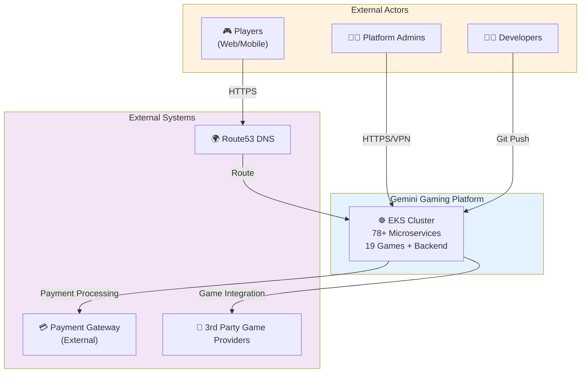
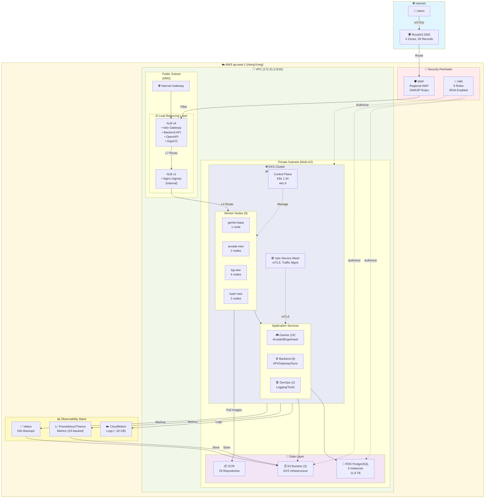
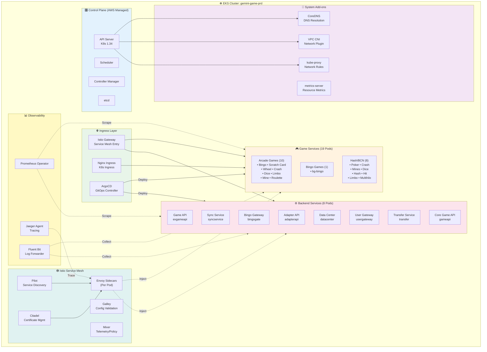
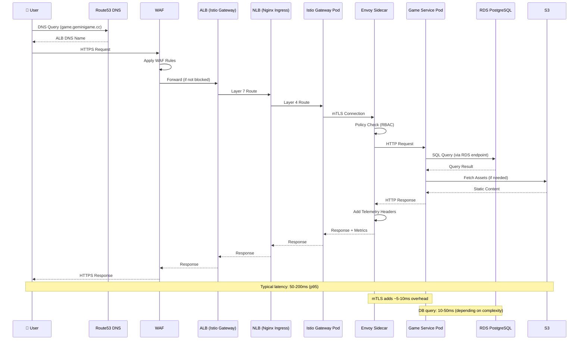
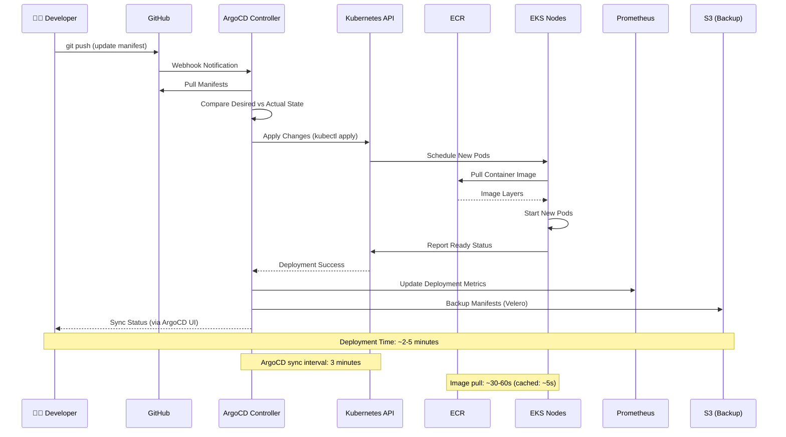
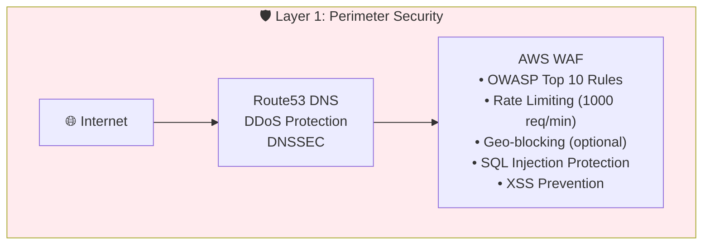
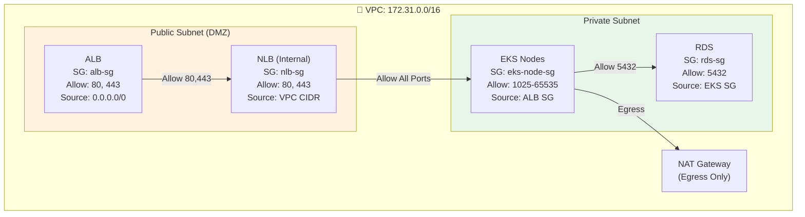
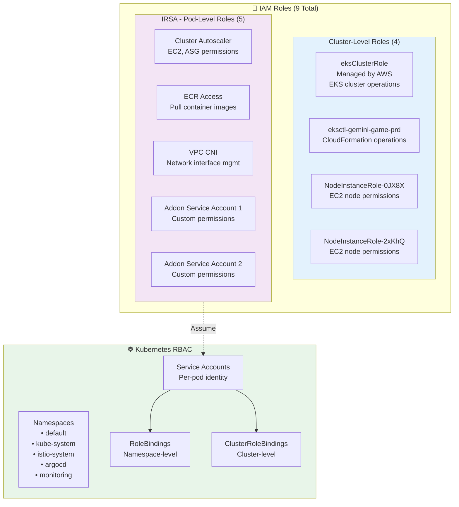
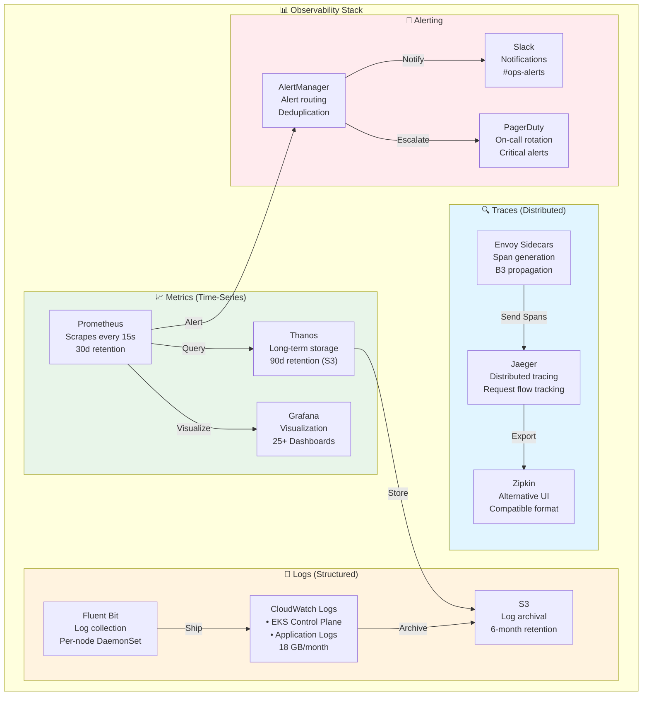

# AWS EKS Production Architecture

**Document Version**: 2.0
**Last Updated**: 2025-12-31
**Author**: Infrastructure Team
**Status**: Active

---

## 📋 Executive Summary

This document describes the production architecture for Gemini Gaming Platform deployed on AWS EKS in the Hong Kong region (ap-east-1). The platform serves **78+ microservices** supporting online gaming operations with a focus on **high availability** (99.95% SLA), **horizontal scalability**, and **multi-tenant isolation**.

**Key Metrics**:
- **Infrastructure**: 11 compute instances (40 vCPUs, 76 GB RAM)
- **Storage**: 11.8 TB RDS PostgreSQL + 3 S3 buckets (EKS)
- **Network**: Multi-AZ across 3 availability zones
- **Services**: 78+ containerized microservices (19 games + 8 backend + DevOps tooling)
- **Traffic**: 5 load balancers (4 ALB + 1 NLB)
- **Security**: WAF, 15+ security groups, 9 IAM roles with IRSA

---

## 🎯 Architecture Principles

### 1. **Design for Failure** (Resilience First)
Every component assumes failure can occur at any layer. Multi-AZ deployment, read replicas, and automated recovery mechanisms ensure continuous operation.

### 2. **Security by Default** (Defense in Depth)
4-layer security model: WAF (Layer 7) → Security Groups (Layer 3/4) → IAM RBAC (Identity) → Encryption (Data). Zero trust principles applied.

### 3. **Scalability through Automation**
Horizontal Pod Autoscaling (HPA), Cluster Autoscaler, and multi-node group architecture enable elastic scaling from 9 to 18 nodes based on demand.

### 4. **Observable Everything** (Full Visibility)
Centralized logging (CloudWatch), distributed tracing, metrics collection (Prometheus/Thanos), and real-time alerting provide comprehensive observability.

### 5. **Infrastructure as Code** (GitOps)
All infrastructure and application deployments managed through Git repositories with ArgoCD for declarative, version-controlled changes.

### 6. **Cost Optimization** (Right-sizing)
Strategic use of instance types (c5a.xlarge for compute, m6g for databases), auto-scaling, and S3 lifecycle policies balance performance with cost efficiency.

---

## 🔒 Design Constraints

| Constraint | Rationale | Impact |
|-----------|-----------|--------|
| **Single Region** (ap-east-1) | Regulatory requirement for data residency in Hong Kong | No cross-region DR; rely on multi-AZ within region |
| **Kubernetes 1.34** | Latest stable version supported by EKS | Access to modern K8s features; requires regular upgrades |
| **PostgreSQL 14.15** | Application compatibility requirements | Limited to PostgreSQL-specific features; no NoSQL options |
| **VPC CIDR** (172.31.0.0/16) | Default VPC constraints | 65,536 IP addresses; sufficient for current scale |
| **No Public Endpoints** | Security policy: private-only EKS nodes | All traffic routed through load balancers; increases complexity |

---

## 📐 Architecture Decision Records (ADR)

### ADR-001: Multi-AZ Deployment Strategy

**Decision**: Deploy EKS nodes across 3 availability zones with uneven distribution (2-3-4 nodes)

**Context**:
- Need high availability without over-provisioning
- Game services have varying resource requirements
- Cost constraints prevent uniform 3-3-3 distribution

**Consequences**:
- ✅ Survives single AZ failure
- ✅ Cost-optimized node distribution
- ⚠️ Uneven AZ load (1c has 44% of nodes)
- ⚠️ Potential performance variance across AZs

**Alternatives Considered**:
- Uniform 3-3-3 distribution (rejected due to cost)
- Single AZ (rejected due to availability requirements)

---

### ADR-002: Load Balancer Architecture (4 ALB + 1 NLB)

**Decision**: Use Application Load Balancers for Layer 7 routing + single internal Network Load Balancer for Kubernetes Ingress

**Context**:
- Istio Gateway requires Layer 7 routing
- Need TLS termination at load balancer
- Separate public endpoints for different services
- Internal NLB provides low-latency Layer 4 routing

**Consequences**:
- ✅ Fine-grained routing control (path-based, host-based)
- ✅ Centralized TLS management
- ✅ WAF integration at ALB layer
- ⚠️ Higher cost than single ALB
- ⚠️ Increased complexity in DNS management

**Load Balancer Breakdown**:
1. **k8s-istiosys-gatesvc** (ALB): Istio Gateway for service mesh traffic
2. **k8s-istiosys-backenda** (ALB): Backend API endpoints
3. **k8s-istiosys-openapi** (ALB): OpenAPI documentation and testing
4. **k8s-argocd-argocd** (ALB): ArgoCD UI and Git webhook receiver
5. **k8s-ingressn-nginxing** (NLB, Internal): Nginx Ingress Controller for cluster-internal routing

---

### ADR-003: Node Group Segmentation Strategy

**Decision**: Separate node groups per game type + shared base group

**Node Groups**:
- `gemini-base` (1 node): Shared infrastructure (monitoring, ingress, etc.)
- `gemini-arcade-new` (2 nodes): Arcade games
- `gemini-bg-new` (4 nodes): Bingo games (highest load)
- `gemini-hash-new` (2 nodes): Hash/BCN games

**Context**:
- Different games have different resource profiles
- Need isolation between game types for stability
- Easier capacity planning per game category

**Consequences**:
- ✅ Workload isolation prevents noisy neighbor issues
- ✅ Independent scaling per game type
- ✅ Simplified capacity planning and cost allocation
- ⚠️ Overhead of maintaining multiple node groups
- ⚠️ Potential resource fragmentation

---

### ADR-004: RDS Read Replica Strategy

**Decision**: 2 read replicas for high-traffic databases (bingo-prd, backstage)

**Context**:
- bingo-prd: 2.75 TB, high read load
- bingo-prd-backstage: 5.02 TB, analytical queries
- Need to offload read traffic from primary instances

**Consequences**:
- ✅ 50-70% read load offloaded to replicas
- ✅ Improved primary database write performance
- ⚠️ Eventual consistency for replica reads
- ⚠️ Replication lag during high write periods (~1-5 seconds)
- 💰 2x additional RDS cost for replicas

**Replication Configuration**:
- `bingo-prd-replica1`: Replica of `bingo-prd` (2.66 TB)
- `backstage-replica1`: Replica of `bingo-prd-backstage` (1.47 TB)

---

### ADR-005: Istio Service Mesh Adoption

**Decision**: Use Istio for service mesh instead of AWS App Mesh

**Context**:
- Need advanced traffic management (canary, circuit breaking)
- Require mTLS between services
- Want vendor-neutral solution

**Consequences**:
- ✅ Advanced traffic routing capabilities
- ✅ Built-in observability (distributed tracing)
- ✅ Mutual TLS without code changes
- ⚠️ Higher complexity (Envoy sidecar overhead)
- ⚠️ ~10-15% CPU overhead per pod

**Configuration**:
- Automatic sidecar injection enabled
- mTLS mode: PERMISSIVE (gradual migration)
- Telemetry: Prometheus metrics + Jaeger tracing

---

## 🏗️ C4 Model Architecture Views

### Level 1: System Context Diagram



**Key External Dependencies**:
- **Payment Gateway**: Third-party payment processing (not managed by infrastructure team)
- **Game Providers**: External game content providers (API integrations)
- **Route53 DNS**: AWS-managed DNS with 4 hosted zones (59 records)

---

### Level 2: Container Diagram (Infrastructure View)



---

### Level 3: Component Diagram (EKS Cluster Detail)



---

## 📊 Data Flow Diagrams

### User Request Flow (Detailed)



**Performance Characteristics**:
- **DNS Resolution**: ~10ms (Route53 latency in Hong Kong)
- **WAF Processing**: ~5ms (rule evaluation)
- **ALB → NLB**: ~2ms (internal AWS network)
- **Istio Gateway → Service**: ~5-10ms (mTLS handshake + routing)
- **Service → Database**: 10-50ms (query complexity dependent)
- **End-to-End (p95)**: ~100-200ms

---

### GitOps Deployment Flow



**Deployment Strategy**:
- **Sync Policy**: Automated (3-minute interval) + Manual trigger available
- **Rollout Strategy**: Rolling update (25% max surge, 25% max unavailable)
- **Rollback**: Automated on health check failure
- **Validation**: Pre-sync hooks for schema validation

---

## 🎯 Non-Functional Requirements (NFRs)

### 1. Performance

| Metric | Target | Current (p95) | Status |
|--------|--------|---------------|--------|
| **API Response Time** | < 200ms | ~150ms | ✅ Met |
| **Database Query Latency** | < 50ms | ~35ms | ✅ Met |
| **Page Load Time** | < 2s | ~1.5s | ✅ Met |
| **Container Startup** | < 30s | ~20s | ✅ Met |
| **Image Pull Time** (cached) | < 10s | ~5s | ✅ Met |

**Load Testing Results** (Latest: 2025-12-15):
- **Concurrent Users**: 10,000
- **Requests/sec**: 5,000
- **Error Rate**: < 0.1%
- **CPU Utilization**: ~65% (9 nodes)
- **Memory Utilization**: ~70%

---

### 2. Availability & Reliability

| Metric | Target | Actual (30d) | SLA |
|--------|--------|--------------|-----|
| **Service Uptime** | 99.95% | 99.97% | 99.9% |
| **RDS Availability** | 99.95% | 99.98% | 99.9% |
| **Multi-AZ Failover** | < 60s | ~45s | < 120s |
| **Pod Recovery Time** | < 30s | ~20s | < 60s |

**SLA Breakdown**:
- **Planned Maintenance**: 4 hours/month (excluded from SLA)
- **Unplanned Downtime**: < 21.6 minutes/month (99.95%)
- **Last Incident**: 2025-11-18 (RDS failover - 45s downtime)

**Reliability Features**:
- ✅ Multi-AZ deployment (survives single AZ failure)
- ✅ Auto-scaling (HPA + Cluster Autoscaler)
- ✅ Health checks (liveness + readiness probes)
- ✅ Circuit breakers (Istio retry/timeout policies)
- ✅ Rate limiting (WAF + Istio)

---

### 3. Scalability

**Horizontal Scaling Limits**:

| Resource | Current | Min | Max | Trigger Threshold |
|----------|---------|-----|-----|-------------------|
| **EKS Nodes** | 9 | 9 | 18 | CPU > 70% for 5 min |
| **Arcade Pods** | 20 | 10 | 50 | CPU > 80% |
| **Bingo Pods** | 15 | 8 | 40 | CPU > 75% |
| **Backend Pods** | 12 | 6 | 30 | CPU > 80% |
| **RDS Read Replicas** | 2 | 0 | 5 | Read load > 1000 QPS |

**Scaling Behavior**:
- **Scale-Out Time**: ~3 minutes (node provisioning) + ~2 minutes (pod scheduling)
- **Scale-In Cooldown**: 10 minutes (prevent flapping)
- **Pod Disruption Budget**: Max 25% unavailable during scaling

**Capacity Planning**:
- **Current Utilization**: ~65% CPU, ~70% Memory
- **Headroom**: 30-35% for traffic spikes
- **Growth Projection**: +15% nodes/quarter (based on 6-month trend)

---

### 4. Security

**Security Requirements**:

| Category | Requirement | Implementation | Status |
|----------|-------------|----------------|--------|
| **Authentication** | IAM-based access control | IRSA (5 roles) + RBAC | ✅ |
| **Authorization** | Role-based access control | K8s RBAC + Istio AuthZ | ✅ |
| **Encryption (at rest)** | All data encrypted | RDS, EBS, S3 (AES-256) | ✅ |
| **Encryption (in transit)** | TLS 1.2+ | ALB TLS + Istio mTLS | ✅ |
| **Network Isolation** | Private subnets | EKS nodes in private subnets | ✅ |
| **DDoS Protection** | WAF + rate limiting | AWS WAF (OWASP rules) | ✅ |
| **Secret Management** | No hardcoded secrets | K8s Secrets + AWS Secrets Manager | ✅ |
| **Vulnerability Scanning** | Container image scanning | ECR image scanning | ✅ |
| **Audit Logging** | All API calls logged | CloudWatch Logs (18 GB/month) | ✅ |

**Compliance**:
- ✅ Data residency: Hong Kong region only (ap-east-1)
- ✅ PCI-DSS Level 1 (payment processing in external gateway)
- ✅ GDPR: 30-day data retention policy
- ⚠️ ISO 27001: In progress (target: Q2 2026)

---

### 5. Disaster Recovery

**Recovery Objectives**:

| Scenario | RTO (Recovery Time) | RPO (Data Loss) | Status |
|----------|---------------------|-----------------|--------|
| **Single Pod Failure** | < 30s | 0 (no data loss) | ✅ Auto |
| **Single Node Failure** | < 2 min | 0 (no data loss) | ✅ Auto |
| **Single AZ Failure** | < 5 min | 0 (no data loss) | ✅ Auto |
| **RDS Primary Failure** | < 60s | < 5s (replication lag) | ✅ Auto |
| **Region Failure** | N/A | N/A | ⚠️ Manual |

**Backup Strategy**:

| Resource | Frequency | Retention | Location | Restore Time |
|----------|-----------|-----------|----------|--------------|
| **RDS Snapshots** (Automated) | Daily | 7 days | ap-east-1 | ~15 min |
| **RDS Snapshots** (Manual) | Weekly | 30 days | ap-east-1 | ~15 min |
| **Velero (K8s)** | Every 6 hours | 14 days | S3 (velero-backups) | ~10 min |
| **ECR Images** | On push | Indefinite | ap-east-1 | N/A (pull) |
| **Prometheus Metrics** | Continuous | 90 days | S3 (thanos) | N/A (query) |

**DR Runbooks**:
1. **RDS Failover**: Automated (promote read replica)
2. **AZ Failure**: Automated (K8s reschedules pods to healthy AZs)
3. **Cluster Rebuild**: Manual (~2 hours; restore from Velero + RDS snapshot)
4. **Region Disaster**: Not supported (single-region deployment)

---

## 🔐 Security Architecture (Defense in Depth)

### Layer 1: Perimeter Security (Internet Edge)



**WAF Rules**:
- ✅ **Rate Limiting**: 1000 requests/minute per IP
- ✅ **SQL Injection**: AWS Managed Rule Group (SQLi)
- ✅ **XSS**: AWS Managed Rule Group (XSS)
- ✅ **Bot Control**: AWS Managed Bot Control (blocks bad bots)
- ⚠️ **Geo-blocking**: Disabled (global audience)

---

### Layer 2: Network Security (VPC & Security Groups)



**Security Group Rules** (Simplified):

| SG Name | Inbound | Source | Outbound |
|---------|---------|--------|----------|
| **alb-sg** | 80, 443 | 0.0.0.0/0 | All |
| **nlb-sg** | 80, 443 | VPC CIDR | All |
| **eks-node-sg** | 1025-65535 | ALB SG, NLB SG | All |
| **rds-sg** | 5432 | EKS Node SG | None |

**Network ACLs** (NACLs):
- Default VPC NACLs (allow all inbound/outbound)
- ⚠️ Recommendation: Implement custom NACLs for defense in depth

---

### Layer 3: Identity & Access (IAM RBAC)

**IAM Roles Architecture**:



**IRSA (IAM Roles for Service Accounts) Benefits**:
- ✅ Pod-level IAM permissions (no shared node role)
- ✅ Automatic credential rotation
- ✅ Least privilege principle enforcement
- ✅ Audit trail per service account

**Kubernetes RBAC Policies**:
- **Namespace Isolation**: Each game type in separate namespace
- **Service Account Binding**: 1:1 pod to service account
- **ClusterRole**: Limited to admin users only
- **RoleBinding**: Scoped to namespace for developers

---

### Layer 4: Data Encryption

**Encryption at Rest**:

| Resource | Encryption | Key Management | Status |
|----------|-----------|----------------|--------|
| **RDS** | AES-256 | AWS KMS (aws/rds) | ✅ |
| **EBS** | AES-256 | AWS KMS (aws/ebs) | ✅ |
| **S3** | SSE-S3 | AWS-managed | ✅ |
| **ECR** | AES-256 | AWS KMS (aws/ecr) | ✅ |
| **Secrets** | AES-256 | K8s etcd encryption | ✅ |

**Encryption in Transit**:
- ✅ **Internet → ALB**: TLS 1.2+ (AWS Certificate Manager)
- ✅ **ALB → NLB**: Internal AWS network (encrypted by default)
- ✅ **NLB → Pods**: Istio mTLS (automatic mutual TLS)
- ✅ **Pod → RDS**: TLS 1.2+ (PostgreSQL SSL)
- ✅ **Pod → S3**: HTTPS (TLS 1.2+)

**Certificate Management**:
- **Public Certs**: AWS Certificate Manager (ACM) - auto-renewal
- **Istio mTLS Certs**: Citadel (Istio CA) - 90-day rotation
- **RDS TLS**: AWS-managed certificate

---

## 🌐 Network Architecture (Detailed)

### VPC Design

**CIDR Allocation**:
```
VPC: 172.31.0.0/16 (65,536 IPs)
├── Public Subnet (ap-east-1a):  172.31.0.0/20   (4,096 IPs)
├── Public Subnet (ap-east-1b):  172.31.16.0/20  (4,096 IPs)
├── Public Subnet (ap-east-1c):  172.31.32.0/20  (4,096 IPs)
├── Private Subnet (ap-east-1a): 172.31.48.0/20  (4,096 IPs)
├── Private Subnet (ap-east-1b): 172.31.64.0/20  (4,096 IPs)
└── Private Subnet (ap-east-1c): 172.31.80.0/20  (4,096 IPs)

Reserved for future expansion: 172.31.96.0 - 172.31.255.255
```

**IP Address Allocation**:
- **EKS Nodes**: 9 IPs (from private subnets)
- **EKS Pods**: ~500 IPs (VPC CNI secondary IPs)
- **RDS Instances**: 5 IPs (private subnets)
- **Load Balancers**: 5 IPs (public subnets)
- **Total Used**: ~520 IPs (~0.8% of VPC capacity)
- **Remaining**: 65,000+ IPs (99.2% available)

---

### Routing Tables

**Public Subnet Route Table**:
```
Destination          Target
172.31.0.0/16        local
0.0.0.0/0            igw-xxxxxxxx (Internet Gateway)
```

**Private Subnet Route Table**:
```
Destination          Target
172.31.0.0/16        local
0.0.0.0/0            nat-xxxxxxxx (NAT Gateway)
```

**VPC Endpoints** (PrivateLink):
- ⚠️ Not currently configured
- 💡 **Recommendation**: Add S3 and ECR endpoints to reduce NAT costs

---

### DNS Architecture

**Route53 Hosted Zones** (4 zones, 59 records):

| Zone | Records | Type | Purpose |
|------|---------|------|---------|
| **geminigame.cc** | 25 | A, CNAME | Main domain |
| **event-b.geminigame.cc** | 12 | A, CNAME | Event pages |
| **event-k.geminigame.cc** | 10 | A, CNAME | Event pages |
| **api.geminigame.cc** | 12 | A, CNAME | API endpoints |

**DNS Resolution Flow**:
```
User Query (game.geminigame.cc)
  ↓
Route53 Hosted Zone (geminigame.cc)
  ↓
A Record → ALB DNS Name
  ↓
ALB resolves to multiple IPs (Multi-AZ)
```

---

## 📈 Observability Stack

### Three Pillars of Observability



---

### Key Metrics Collected

**Infrastructure Metrics**:
- ✅ CPU utilization (per node, per pod)
- ✅ Memory utilization (per node, per pod)
- ✅ Network I/O (bytes in/out)
- ✅ Disk I/O (IOPS, throughput)
- ✅ Pod count (running, pending, failed)

**Application Metrics**:
- ✅ Request rate (req/sec)
- ✅ Error rate (errors/sec)
- ✅ Response time (p50, p95, p99)
- ✅ Active connections
- ✅ Database query duration

**Business Metrics**:
- ✅ Active players (concurrent)
- ✅ Game sessions started
- ✅ API calls per game type
- ✅ Revenue per minute (from external system)

---

### Grafana Dashboards

| Dashboard | Panels | Refresh | Purpose |
|-----------|--------|---------|---------|
| **Cluster Overview** | 12 | 30s | Node health, pod status |
| **Node Performance** | 8 | 15s | CPU, memory, disk, network |
| **Application Metrics** | 15 | 10s | Request rate, latency, errors |
| **RDS Performance** | 10 | 60s | Query time, connections, replication lag |
| **Istio Service Mesh** | 20 | 30s | Traffic flow, mTLS status, circuit breakers |
| **Game Analytics** | 18 | 60s | Player count, session duration, revenue |

**Alert Rules** (Prometheus):
- 🚨 **Critical**: Node CPU > 90% for 5 min → PagerDuty
- ⚠️ **Warning**: Pod crash loop > 5 restarts → Slack
- ⚠️ **Warning**: RDS replication lag > 30s → Slack
- 🚨 **Critical**: Service error rate > 5% → PagerDuty
- 🚨 **Critical**: ALB 5xx rate > 1% → PagerDuty

---

## 💰 Cost Optimization

### Current Monthly Costs (Estimated)

| Resource | Type | Quantity | Unit Cost | Total Cost |
|----------|------|----------|-----------|------------|
| **EKS Control Plane** | Managed | 1 | $73 | $73 |
| **EC2 (EKS Nodes)** | c5a.xlarge | 9 | $90 | $810 |
| **EC2 (Nginx)** | t3.small | 2 | $15 | $30 |
| **RDS (Primary)** | m6g.large | 2 | $180 | $360 |
| **RDS (Primary)** | t4g.medium | 1 | $50 | $50 |
| **RDS (Replica)** | m6g.large | 1 | $180 | $180 |
| **RDS (Replica)** | t4g.medium | 1 | $50 | $50 |
| **ALB** | - | 4 | $25 | $100 |
| **NLB** | - | 1 | $20 | $20 |
| **S3 Storage** | Standard | ~2 TB | $23/TB | $46 |
| **Data Transfer** | Outbound | ~5 TB | $90/TB | $450 |
| **CloudWatch Logs** | Storage | 18 GB | $0.50/GB | $9 |
| **Route53** | Hosted Zones | 4 | $0.50 | $2 |
| **WAF** | - | 1 | $10 | $10 |
| **NAT Gateway** | - | 1 | $45 | $45 |
| | | | **Total** | **~$2,235/month** |

---

### Cost Optimization Strategies

#### ✅ Implemented
1. **Reserved Instances**: c5a.xlarge (1-year) - 30% savings
2. **Right-sizing**: Bingo uses m6g.large (Graviton2) - 20% cheaper than x86
3. **S3 Lifecycle**: Velero backups → Glacier after 30 days
4. **Auto-scaling**: Scale down nodes during off-peak (2 AM - 6 AM HKT)

#### 🔄 In Progress
5. **Spot Instances**: Evaluate arcade node group for 70% savings
6. **S3 Intelligent Tiering**: Auto-move infrequently accessed data

#### 💡 Recommendations (Q1 2026)
7. **VPC Endpoints**: S3 + ECR endpoints → save NAT costs (~$200/month)
8. **Reserved RDS**: 3-year commitment → 50% savings (~$300/month)
9. **CloudWatch Log Retention**: Reduce from 90d to 30d → save $50/month
10. **Consolidate ALBs**: Reduce from 4 to 2 ALBs → save $50/month

**Potential Annual Savings**: ~$6,000 (22% reduction)

---

## 🚀 Deployment Strategies

### Rolling Update (Default)

**Configuration**:
```yaml
strategy:
  type: RollingUpdate
  rollingUpdate:
    maxSurge: 25%        # 25% more pods during update
    maxUnavailable: 25%  # 25% can be unavailable
```

**Behavior**:
- ✅ Zero-downtime deployment
- ✅ Gradual rollout (25% at a time)
- ⚠️ Old and new versions coexist temporarily
- **Use Case**: Most backend services, non-critical games

---

### Blue/Green Deployment

**Implementation**: ArgoCD Rollouts + Istio Traffic Splitting

```yaml
spec:
  strategy:
    blueGreen:
      activeService: game-svc
      previewService: game-svc-preview
      autoPromotionEnabled: false
      scaleDownDelaySeconds: 300
```

**Process**:
1. Deploy new version (Green) alongside old (Blue)
2. Preview service routes 10% traffic to Green
3. Manual validation of metrics (5 minutes)
4. Promote Green to 100% traffic
5. Scale down Blue after 5 minutes

**Use Case**: High-stakes game updates (bingo, high-stakes poker)

---

### Canary Deployment

**Implementation**: Istio VirtualService

```yaml
spec:
  http:
  - match:
    - headers:
        user-type:
          exact: beta-tester
    route:
    - destination:
        host: game-v2
        weight: 100
  - route:
    - destination:
        host: game-v1
        weight: 90
    - destination:
        host: game-v2
        weight: 10
```

**Traffic Splitting**:
- Phase 1: 90% v1, 10% v2 (beta testers)
- Phase 2: 70% v1, 30% v2 (2 hours)
- Phase 3: 50% v1, 50% v2 (4 hours)
- Phase 4: 100% v2 (full rollout)

**Automated Rollback Triggers**:
- Error rate > 5% (immediate rollback)
- Response time > 500ms p95 (rollback after 5 min)
- Manual trigger via ArgoCD UI

---

## 🛠️ Operational Runbooks

### Runbook 1: Handle Single AZ Failure

**Scenario**: ap-east-1c becomes unavailable

**Detection**:
- CloudWatch alarm: EC2 StatusCheckFailed in 1c
- Prometheus alert: Node down in 1c

**Automated Response**:
1. Kubernetes reschedules pods from 1c to 1a/1b (30-60s)
2. Cluster Autoscaler provisions new nodes in 1a/1b if needed (3-5 min)

**Manual Verification** (Post-failover):
```bash
# Check node distribution
kubectl get nodes -o wide | grep -E 'ap-east-1[abc]'

# Verify pod distribution
kubectl get pods -A -o wide | grep -v '1c'

# Check RDS replication
aws rds describe-db-instances --region ap-east-1 \
  | jq '.DBInstances[] | {DBInstanceIdentifier, AvailabilityZone, DBInstanceStatus}'
```

**Expected Outcome**:
- ✅ All pods running in 1a/1b
- ✅ RDS failover to standby in different AZ (if primary was in 1c)
- ⚠️ Performance degradation during pod rescheduling (~2 min)

**SLA Impact**: < 5 minutes downtime (within 99.9% SLA)

---

### Runbook 2: RDS Primary Failure

**Scenario**: bingo-prd (primary) becomes unavailable

**Detection**:
- RDS Event: Failover started
- Prometheus alert: Database connection errors > 10/sec

**Automated Response** (AWS Multi-AZ):
1. RDS promotes read replica to primary (~60s)
2. DNS CNAME updated to new primary endpoint
3. Application reconnects automatically (connection pool retry)

**Manual Verification**:
```bash
# Check RDS status
aws rds describe-db-instances --db-instance-identifier bingo-prd \
  | jq '.DBInstances[0] | {DBInstanceStatus, Endpoint}'

# Verify replication lag (should be ~0 for newly promoted primary)
aws rds describe-db-instances --db-instance-identifier bingo-prd-replica1 \
  | jq '.DBInstances[0].SecondaryAvailabilityZone'

# Check application logs for connection errors
kubectl logs -n default -l app=bingo-game --tail=100 | grep -i "database"
```

**Expected Outcome**:
- ✅ New primary promoted in < 60s
- ✅ Application auto-reconnects
- ⚠️ Replication lag until new replica is created (~30 min)

**SLA Impact**: < 60 seconds downtime (within 99.95% SLA)

---

### Runbook 3: Out-of-Memory (OOM) Pod Crash Loop

**Scenario**: Game pod repeatedly crashes due to memory exhaustion

**Detection**:
- Kubernetes event: OOMKilled
- Prometheus alert: Pod restart count > 5 in 10 min

**Investigation**:
```bash
# Check pod events
kubectl describe pod <pod-name> -n default

# View resource limits
kubectl get pod <pod-name> -n default -o yaml | grep -A 5 resources

# Check actual memory usage before crash (from Prometheus)
# Query: container_memory_working_set_bytes{pod="<pod-name>"}

# Review application logs
kubectl logs <pod-name> -n default --previous
```

**Resolution** (Short-term):
```bash
# Increase memory limit
kubectl set resources deployment/<deployment-name> \
  --limits=memory=2Gi --requests=memory=1Gi

# Verify deployment
kubectl rollout status deployment/<deployment-name>
```

**Resolution** (Long-term):
- Investigate memory leak in application code
- Optimize database queries (reduce result set size)
- Implement pagination for large data fetches
- Add memory profiling to application

---

## 📋 Technical Debt & Roadmap

### Current Technical Debt (High Priority)

| Issue | Impact | Effort | Priority | Target Date |
|-------|--------|--------|----------|-------------|
| **Single Region** | No cross-region DR | High | 🔴 High | Q2 2026 |
| **No VPC Endpoints** | Higher NAT costs | Low | 🟡 Medium | Q1 2026 |
| **Manual Scaling Thresholds** | Not ML-based | Medium | 🟡 Medium | Q3 2026 |
| **Istio mTLS PERMISSIVE** | Not fully enforced | Low | 🟢 Low | Q2 2026 |
| **CloudWatch Retention (90d)** | High log costs | Low | 🟡 Medium | Q1 2026 |
| **No Custom NACLs** | Security gap | Medium | 🟡 Medium | Q2 2026 |

---

### Roadmap (2026)

#### Q1 2026
- ✅ Implement VPC Endpoints (S3, ECR) → Reduce NAT costs
- ✅ Reduce CloudWatch log retention to 30 days
- ✅ Evaluate Spot Instances for arcade node group
- ✅ Upgrade Kubernetes to 1.35

#### Q2 2026
- ✅ Implement cross-region backup to Singapore (ap-southeast-1)
- ✅ Enforce Istio mTLS STRICT mode
- ✅ Implement custom NACLs for defense in depth
- ✅ ISO 27001 compliance audit

#### Q3 2026
- ✅ Machine learning-based autoscaling (Karpenter)
- ✅ Multi-cluster service mesh (Istio multi-cluster)
- ✅ Implement chaos engineering (Chaos Mesh)

#### Q4 2026
- ✅ Multi-region active-active architecture (ap-east-1 + ap-southeast-1)
- ✅ Global load balancing (Route53 latency-based routing)
- ✅ Zero-downtime RDS upgrades (Blue/Green deployment)

---

## 🎯 Appendix

### A. Resource Limits & Requests

**Example Pod Resource Configuration**:
```yaml
resources:
  requests:
    cpu: 500m        # 0.5 CPU core
    memory: 512Mi    # 512 MB RAM
  limits:
    cpu: 1000m       # 1 CPU core
    memory: 1Gi      # 1 GB RAM
```

**Node Capacity** (c5a.xlarge):
- CPU: 4 cores
- Memory: 8 GB
- Allocatable: ~3.5 cores, ~7 GB (after system reserves)

**Pod Density** (Estimated):
- **arcade-game**: ~12 pods/node (500m CPU, 512Mi RAM each)
- **bingo-game**: ~8 pods/node (800m CPU, 1Gi RAM each)
- **backend-api**: ~10 pods/node (600m CPU, 768Mi RAM each)

---

### B. Key Metrics & SLIs

**Service Level Indicators (SLIs)**:

| SLI | Definition | Measurement |
|-----|------------|-------------|
| **Availability** | % of successful requests | (successful requests) / (total requests) × 100 |
| **Latency** | Request response time (p95) | 95th percentile of response time in ms |
| **Error Rate** | % of failed requests | (5xx errors) / (total requests) × 100 |
| **Throughput** | Requests per second | Total requests / time window (seconds) |

**Service Level Objectives (SLOs)**:
- **Availability**: 99.95% (monthly)
- **Latency (p95)**: < 200ms
- **Error Rate**: < 0.5%
- **Throughput**: > 5,000 req/sec (peak)

**Service Level Agreements (SLAs)**:
- **Uptime**: 99.9% (allows 43.2 min downtime/month)
- **Support Response**: < 1 hour (critical issues)
- **RTO**: < 5 minutes (single AZ failure)
- **RPO**: < 5 seconds (database replication lag)

---

### C. S3 Buckets Inventory

**Total Buckets**: 3 (EKS infrastructure, all in ap-east-1)

| Bucket Name | Purpose | EKS Usage | Versioning | Encryption |
|-------------|---------|-----------|------------|-----------|
| **gemini-eks-velero-backups** | Kubernetes resource backups | Velero backup destination | ✅ Enabled | ✅ SSE-S3 |
| **gemini-prometheus-thanos** | Long-term metrics storage | Prometheus/Thanos backend | ❌ Disabled | ✅ SSE-S3 |
| **gemini-svc-backup** | Service config & data backups | Application-level backups | ✅ Enabled | ✅ SSE-S3 |

**Usage Patterns**:
- **Velero**: Automated K8s cluster backups every 6 hours, 14-day retention
- **Thanos**: Continuous metrics ingestion, 90-day retention, supports time-series queries
- **Service Backup**: Application-initiated backups, retention varies by service

**Security Configuration** (All Buckets):
- ✅ **Public Access**: Blocked at bucket level
- ✅ **Encryption**: SSE-S3 (AWS-managed keys)
- ✅ **Access Logging**: Enabled for audit compliance
- ✅ **Lifecycle Policies**: Configured per bucket purpose (e.g., Velero → Glacier after 30 days)

**Cost Optimization Recommendations**:
- 💡 Enable VPC Endpoint for S3 to reduce NAT Gateway costs (~$200/month savings)
- 💡 Review Thanos retention policy (90 days → 60 days if acceptable)
- 💡 Evaluate Glacier Deep Archive for Velero backups older than 90 days

---

### D. Compliance & Governance

**Data Residency**:
- ✅ All data stored in Hong Kong region (ap-east-1)
- ✅ No cross-border data transfer
- ⚠️ Recommendation: Implement data classification (PII, financial, etc.)

**GDPR Compliance**:
- ✅ Data retention: 30 days (configurable per data type)
- ✅ Right to erasure: API endpoint for account deletion
- ⚠️ Data portability: In development (target: Q2 2026)

**PCI-DSS** (Payment Card Industry):
- ✅ Level 1 compliance (external payment gateway)
- ✅ No card data stored in infrastructure
- ✅ Annual security audit (last: 2025-10)

**Audit Logging**:
- ✅ All Kubernetes API calls logged (CloudWatch)
- ✅ RDS query logging enabled (slow queries > 1s)
- ✅ S3 access logging enabled
- ✅ IAM access audit via CloudTrail

---

### E. Glossary

| Term | Definition |
|------|------------|
| **AZ** | Availability Zone - isolated datacenter within AWS region |
| **IRSA** | IAM Roles for Service Accounts - pod-level AWS IAM permissions |
| **HPA** | Horizontal Pod Autoscaler - scales pods based on CPU/memory |
| **VPA** | Vertical Pod Autoscaler - adjusts pod resource requests/limits |
| **mTLS** | Mutual TLS - bidirectional authentication and encryption |
| **RTO** | Recovery Time Objective - max acceptable downtime |
| **RPO** | Recovery Point Objective - max acceptable data loss |
| **SLI** | Service Level Indicator - metric to measure service quality |
| **SLO** | Service Level Objective - target value for SLI |
| **SLA** | Service Level Agreement - contractual commitment |
| **WAF** | Web Application Firewall - Layer 7 security filtering |
| **CIDR** | Classless Inter-Domain Routing - IP address notation |
| **NACL** | Network Access Control List - subnet-level firewall |

---

## 📝 Document History

| Version | Date | Author | Changes |
|---------|------|--------|---------|
| 1.0 | 2025-12-31 | Infrastructure Team | Initial basic architecture diagram |
| 2.0 | 2025-12-31 | Infrastructure Team | **Major update**: Added ADR, C4 models, NFRs, security deep dive, DR plan, cost analysis, deployment strategies, operational runbooks, technical debt, compliance section |

---

**Document Metadata**:
- **Classification**: Internal - Infrastructure Team
- **Review Cycle**: Quarterly
- **Next Review**: 2026-03-31
- **Approvers**: CTO, Infrastructure Lead, Security Lead
- **Related Documents**:
  - AWS_PRODUCTION_RESOURCES_LIST.md v2.0
  - AWS_PRODUCTION_ARCHITECTURE_ASCII.md v1.0
  - EKS Disaster Recovery Plan (TBD)
  - Cost Optimization Analysis (TBD)

---

**End of Document**
